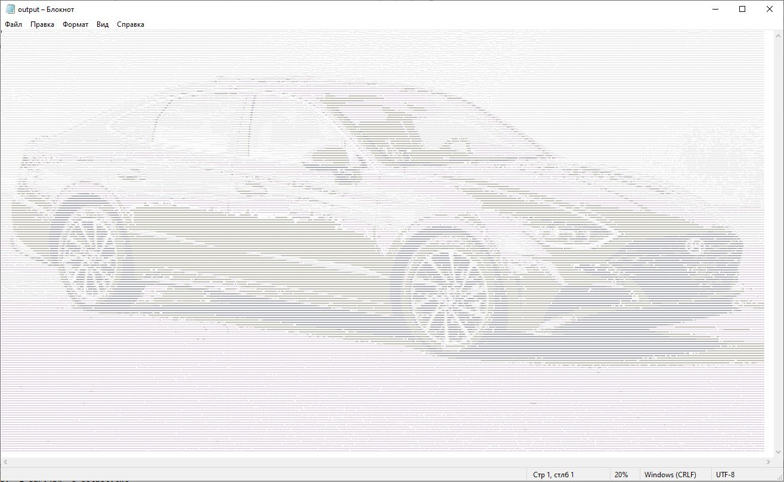

# AsciiArtGenerator
#### Usage:
Run main.py with the command line arguments: 
>-i INPUT_FILE \
>-o OUTPUT_FILE

```shell
python main.py -i car.jpg -o output.png
python main.py -i C:\python\ascii\src\car.jpg -o output.jpg
```

#### Examlpes:



